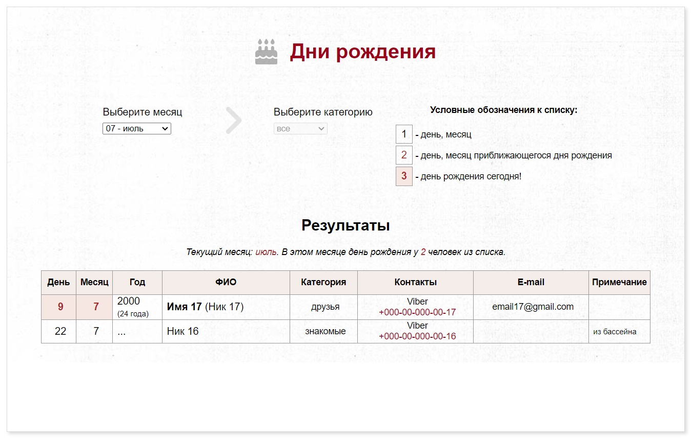

# Birthdates book - книга для записи дней рождения и контактной информации (HTML | CSS | JS)

[Переключиться на английский | Switch to English](./readme.md)

## О проекте
Приложение представляет собой таблицу, содержащую контакты по категориям, дни рождения, дополнительную информацию (ссылки, электронные адреса, телефоны и др.) с фильтрацией по месяцам года. 

**Инструменты:** 

**Языки:** 
 
 
 

**Демо:** [Перейти на страницу приложения -->](https://the-all-spark.github.io/birthdates_book/) 

## Реализованный функционал

1. верстка с использованием grid - фильтры, условные обозначения, блок статистики и блок для вывода результатов (HTML, CSS);
2. отображение информации для текущего месяца при открытии страницы (JS);
3. вывод строк для текущего месяца (JS): 
   - подсчитывается возраст (слово "год (лет)" склоняется);
   - ближайшие дни рождения выделяются цветом;
   - установленная у каждой записи категория выводится на русском языке;
   - никнейм указывается в скобках, если присутствует имя, или без скобок, если имени нет;
   - выводится предупреждение, если строки в результате отсутствуют;
4. сортировка выведенных строк по дате (JS);
5. отображение статистики по текущему месяцу - отображается текущий месяц и количество записей (слово "человек" склоняется) (JS);
6. при переключении месяца таблица очищается; выводятся соответствующие строки (JS);

