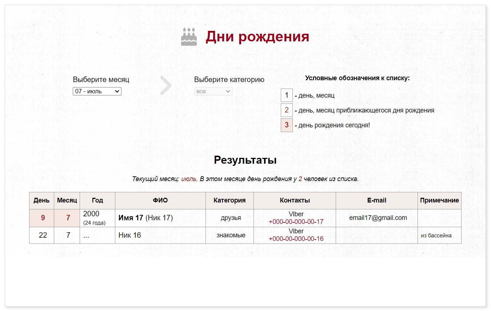

# Birthdates book to record birthdays and contact information (HTML | CSS | JS)

[Switch to Russian | Переключиться на русский](./readme-ru.md)

## About the project
The application is a table containing contacts by category, birthdays, additional information (links, email addresses, phone numbers, etc.) filtered by months of the year. 

**Tools:** 

**Stack:** 
 
 
 

**Demo:** [to the page -->](https://the-all-spark.github.io/birthdates_book/)

## Realized functionality

1. HTML and CSS code using grid - filters, symbols, statistics block and block for outputting results (HTML, CSS);
2. displaying information for the current month when opening the page (JS);
3. outputting strings for the current month (JS): 
   - age is calculated (the word "year(s) (год - лет)" is declined);
   - the nearest birthdays are highlighted in color;
   - the category established for each record is displayed in Russian;
   - nickname is given in brackets if there is a name, or without brackets if there is no name;
   - a warning is displayed if rows are not present in the result;
4. sorting of output rows by date (JS);
5. displaying statistics for the current month - the current month and the number of records are displayed (the word "person" (человек) is declined) (JS);
6. when switching the month, the table is cleared; the corresponding rows are displayed (JS);